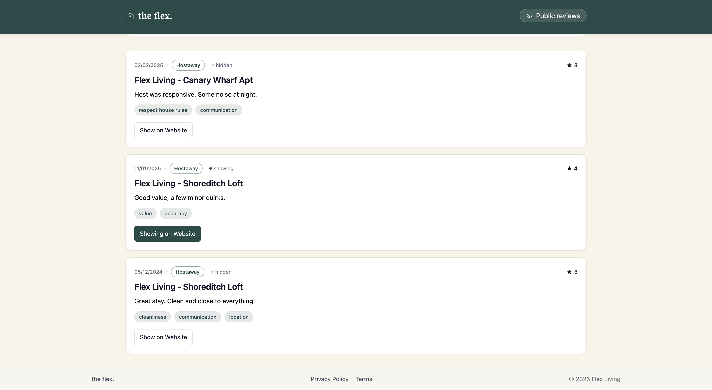

# Flex Living Reviews Dashboard - Guidebook

## Overview
This project is a reviews dashboard for **Flex Living**.  
It fetches property reviews from the Hostaway API (or mock data if the API fails) and displays them with filtering, sorting, and approval features.

The app is built with:
- **Next.js (App Router)**
- **Tailwind CSS** for styling
- **TypeScript** for type safety
- **Vercel** for deployment

## Features
- **Dashboard view** with review count, average rating, and approval stats.
- **Filter options** for:
  - Minimum and maximum rating
  - Category
  - Channel
  - Date range
  - Sorting order
- **Public view** to display approved reviews per property.
- **API Fallback** - automatically loads mock data if API request fails.
- **Approval toggle** to control which reviews appear on the public page.
- **Accessibility** improvements with ARIA attributes and keyboard navigation.
- **Responsive design** for mobile, tablet, and desktop.

## Pages & Routes

### `/` - Dashboard
Displays:
- Review statistics (total reviews, average rating, approved reviews)
- Filter bar with sorting and filtering options
- Review cards with rating, tags, and approval toggle

### `/properties` - Public Properties List
Lists all properties with approved reviews.  
Each property has a link to view its public review page.

### `/properties/[listing]` - Public Review Page
Shows approved reviews for a single property with:
- Review date
- Rating
- Tags
- Review text

### `/privacy`
Outlines:
- What data is collected
- What data is **not** collected
- Data retention policy
- Contact details

### `/terms`
Specifies:
- Usage rules
- Liability disclaimer
- Flex Living’s rights to update terms

## API Routes

- **`/api/reviews/hostaway`** - Fetches reviews from Hostaway API and normalizes the data.  
  Falls back to `/mock/reviews.json` if the API call fails.

- **`/api/reviews/[id]`** - Handles PATCH requests to update review approval state.

## Deployment
The project is deployed on Vercel.

- **Live URL:** https://flex-living-reviews-dashboard-tawny.vercel.app/
- **GitHub Repository:** https://github.com/yaserselvam/flex-living-reviews-dashboard

## Notes for Reviewer
- All assignment requirements implemented and tested in the deployed build.
- Fixes added for:
  - `useSearchParams()` build issues via suspense handling
  - Preserving filter state between dashboard and public views
  - Improved accessibility (semantic HTML, ARIA support, keyboard navigation)
  - Optimized production deployment

## Screenshots

- Dashboard: `public/screenshots/01-dashboard.png`

    

- Public Properties: `public/screenshots/02-properties.png`

    

- Public Review - Canary Wharf: `public/screenshots/03-review-canary.png`

    

- Public Review - Shoreditch: `public/screenshots/04-review-shoreditch.png`

    

- Privacy Policy: `public/screenshots/05-privacy.png`

    

- Terms of Service: `public/screenshots/06-terms.png`

    

- Approval Toggle: `public/screenshots/07-approval-toggle.png`

    

## Run Locally

```bash
# 1) Clone repository
git clone https://github.com/yaserselvam/flex-living-reviews-dashboard.git
cd flex-living-reviews-dashboard

# 2) Install dependencies
npm install

# 3) Env vars (create .env.local)
# If you have Hostaway credentials, add them; otherwise mocks are used automatically.
HOSTAWAY_API_KEY=your_api_key
HOSTAWAY_ACCOUNT_ID=your_account_id

# 4) Dev server
npm run dev
```

## Tech Notes

- **Type safety:** shared types in `lib/types.ts`.
- **Normalization:** raw Hostaway or mock items shaped in `lib/normalize.ts`.
- **Approvals store:** ephemeral in-memory state in `lib/approvalsStore.ts`.
- **Fallbacks:** `lib/hostaway.ts` tries API then falls back to local mock.
- **UI:** components in `components/*` (FilterBar, FiltersClient, ReviewCard, TopNav, Footer, etc.).
- **Accessibility:** semantic HTML, labels, keyboard-friendly controls.
- **Styling:** `app/globals.css` with utility classes; consistent spacing/tokens.

## License
This project is for assignment/demo purposes only.